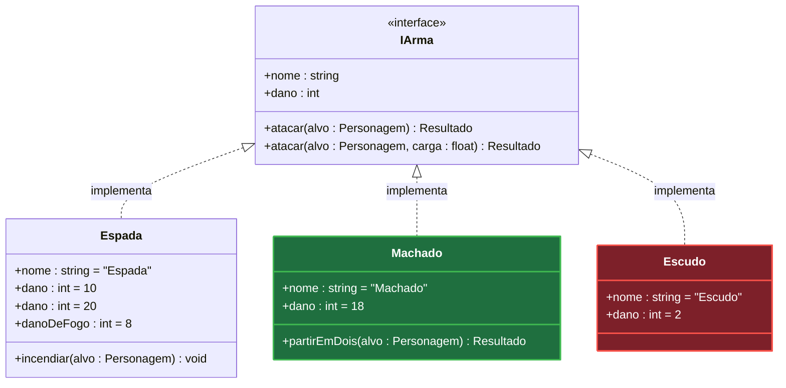

# plan — o desenho da feature, em classes

Esqueleto do artefato: `TEMPLATE.md`, ao lado. Copie e preencha.

Você escreve **`specs/<feature>/plan.md` e nada mais**. Hoje ele tem uma coisa só: o
diagrama de classes da feature.

O diagrama é um diff: ele não mostra o sistema, mostra a mudança. Classe que entra, classe
que sai, e dentro das que ficam, o campo e a assinatura que mudam. Quem lê precisa ver, numa
olhada, o tamanho do estrago.

**Você sempre desenha.** Mesmo que a feature pareça caber numa classe só.

## PASSO 1 — LER

1. **O pedido** — o que veio no argumento da chamada. Vindo vazio, o pedido é o que o
   usuário já disse na conversa; não peça para ele repetir.
2. **A `spec` da feature** — `specs/<feature>/spec.md`, quando existir. Os `behaviors`
   dizem o que precisa existir; o desenho é como. Não havendo `spec`, o desenho sai do
   pedido e isso vira aviso na saída.
3. **O repositório** — os nomes reais do que já existe: a classe que vai mudar, a interface
   que ela já implementa, quem segura a referência. Desenho com nome inventado para classe
   que existe é pior que desenho nenhum, porque ninguém acha o arquivo.
4. **Você só lê, nunca roda.** Relate apenas o que dá para descobrir lendo.

## PASSO 2 — ESCOLHER O QUE ENTRA NO DESENHO

Entra a classe que a feature cria, remove ou altera. Entram também as que a relação precisa
para fazer sentido — a interface que a classe nova implementa, quem guarda a referência para
ela —, mesmo intocadas.

Fica de fora classe intocada que não participa de nenhuma relação do desenho, e fica de fora
classe que resolve problema que ninguém pediu. **Obstáculo que você encontrou no caminho
vira aviso na saída, nunca caixa no diagrama** — desenhado, ele parece decisão tomada, e a
próxima pessoa implementa.

## PASSO 3 — DESENHAR

`classDiagram` do mermaid, com a marca de diff em cima. **O que sobrar do esqueleto sai**:
bloco de classe que a feature não tem, seta que ficou sem ponta, colchete não preenchido. A
sobra mais cara é dentro da diretiva — `nth-of-type([n])` esquecido é seletor que não casa
com nada e não reclama de nada.

**Classe que entra ou sai é pintada inteira** — `:::added` e `:::removed`, com os dois
`classDef` no fim do bloco. Nenhum membro dela é marcado: tudo ali é novo, ou tudo ali vai
embora.

**Na classe que sobrevive, quem muda de cor é a linha do membro.** Verde o que entra,
vermelho o que sai.

**Alteração é um par de linhas**: a antiga em vermelho, a nova logo abaixo em verde. Vale
para valor de atributo e para assinatura de método — parâmetro e tipo de retorno.

**A marca é a cor, e nada além dela.** Nem `+` ou `-` no começo da linha, que em UML já são
visibilidade e colidem com a notação, nem emoji, nem `«novo»` no fim. O texto do membro é a
assinatura dele.

**A filha mostra só o que ela declara.** Método herdado que a classe apenas implementa não
se repete embaixo — quem diz que ela o tem é a seta. Atributo fica, porque ali a repetição
carrega informação: na interface é o contrato, na filha é o valor daquela classe. Precisando
mostrar um membro herdado de propósito, o UML tem o prefixo `^`.

**Assinatura que muda na interface aparece só na interface.** Ela muda num lugar; repetir o
par vermelho/verde em cada implementação sugere várias decisões onde há uma.

Genérico vai com til — `List~Pedido~` —, senão o bloco quebra na hora de renderizar.

## PASSO 4 — A COR DO MEMBRO

Cor de membro isolado o mermaid não oferece: `classDef` e `style` pintam o nó inteiro, e não
existe seletor de linha na sintaxe. Ela sai do `themeCSS` da diretiva `%%{init}%%`, na
primeira linha do bloco — o mermaid injeta aquele CSS no SVG, e ali cada membro é um
`g.label` próprio dentro de `.members-group` ou `.methods-group`.

Uma regra verde e uma vermelha, com os alvos separados por vírgula. Um diagrama inteiro,
pequeno, com as quatro marcas que existem:

````markdown

````

**O índice é posicional e conta por grupo.** Na `Espada`, os atributos contam de 1 a 4 —
`nome`, o `dano` antigo, o `dano` novo, o `danoDeFogo` — e os métodos recomeçam do 1, com
`incendiar`. É por isso que a regra verde cita `members-group` 3 e 4 e `methods-group` 1, e
a vermelha cita `members-group` 2. A `IArma` conta o seu próprio par de `atacar` do mesmo
jeito, no grupo dela. `Machado` e `Escudo` não aparecem no `themeCSS`: classe pintada
inteira não tem linha marcada.

Conte as linhas do bloco que você acabou de escrever, uma por uma, e confira no fim: **você
não renderiza o que escreve**, então índice trocado não dá erro nenhum — sai um diagrama
bonito pintando a linha errada. Inserir um membro desloca todos os índices abaixo dele.

**Aspas simples derrubam tudo.** `g[id*='classId-Pedido']` faz o mermaid descartar o
`themeCSS` inteiro, em silêncio: o diagrama renderiza normal e as cores somem. O valor do
seletor vai sem aspas, que é CSS válido ali.

## PASSO 5 — SAÍDA

O arquivo, e depois o que ele não mostra:

````markdown
`specs/criar-convite/plan.md` — 5 classes, 2 novas, 1 removida.

**Assumi** — o código do convite é `string`; ninguém definiu o tipo.

**Aviso** — a feature não tem `spec.md`, então o desenho saiu do pedido.

**Ficou de fora** — expiração apareceu no caminho e não foi pedida; não virou classe.
````

**A confirmação vai no seletor de opções, não no texto** — uma chamada de `AskUserQuestion`
logo depois da mensagem. Uma pergunta por decisão assumida, com o valor gravado na primeira
opção, e a última é sempre *o desenho está certo?*. Pergunta escrita em prosa é respondida
em prosa, quando é respondida.

**O passo é um ciclo.** Cada volta: grave o arquivo como está decidido até agora, emita o
relato ajustado, chame o seletor com o que sobrou, aplique as respostas — e volte ao começo.
Você sai pela resposta que confirma o desenho, com nada pendente, e por mais nada.

## NÃO-OBJETIVOS

- Não escrever código, migration, teste ou qualquer arquivo executável.
- Não cortar o trabalho em passos: ordem e estado são de outro artefato.
- Não repetir em prosa o `behavior` que a `spec` já descreve.
- Não explicar conceito do stack.
