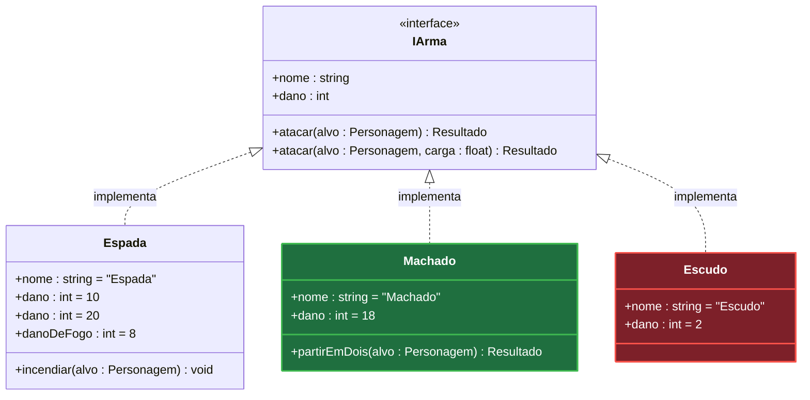

# O diagrama de classes com diff

`classDiagram` do mermaid, com a marca de diff em cima.

## As marcas

**Classe que entra ou sai é pintada inteira** — `:::added` e `:::removed`, com os dois
`classDef` no fim do bloco. Nenhum membro dela é marcado: tudo ali é novo, ou tudo ali vai
embora.

**Na classe que sobrevive, quem muda de cor é a linha do membro.** Verde o que entra,
vermelho o que sai.

**Alteração é um par de linhas**: a antiga em vermelho, a nova logo abaixo em verde. Vale
para valor de atributo e para assinatura de método — parâmetro e tipo de retorno.

**A marca é a cor, e nada além dela.** Nem `+` ou `-` no começo da linha, que em UML já são
visibilidade e colidem com a notação, nem emoji, nem `«novo»` no fim. O texto do membro é a
assinatura dele.

**A filha mostra só o que ela declara.** Método herdado que a classe apenas implementa não
se repete embaixo — quem diz que ela o tem é a seta. Atributo fica, porque ali a repetição
carrega informação: na interface é o contrato, na filha é o valor daquela classe. Precisando
mostrar um membro herdado de propósito, o UML tem o prefixo `^`.

**Assinatura que muda na interface aparece só na interface.** Ela muda num lugar; repetir o
par vermelho/verde em cada implementação sugere várias decisões onde há uma.

Genérico vai com til — `List~Pedido~` —, senão o bloco quebra na hora de renderizar.

## A cor do membro

Cor de membro isolado o mermaid não oferece: `classDef` e `style` pintam o nó inteiro, e não
existe seletor de linha na sintaxe. Ela sai do `themeCSS` da diretiva `%%{init}%%`, na
primeira linha do bloco — o mermaid injeta aquele CSS no SVG, e ali cada membro é um
`g.label` próprio dentro de `.members-group` ou `.methods-group`.

Uma regra verde e uma vermelha, com os alvos separados por vírgula. Um diagrama inteiro,
pequeno, com as quatro marcas que existem:

````markdown

````

**O índice é posicional e conta por grupo.** Na `Espada`, os atributos contam de 1 a 4 —
`nome`, o `dano` antigo, o `dano` novo, o `danoDeFogo` — e os métodos recomeçam do 1, com
`incendiar`. É por isso que a regra verde cita `members-group` 3 e 4 e `methods-group` 1, e
a vermelha cita `members-group` 2. A `IArma` conta o seu próprio par de `atacar` do mesmo
jeito, no grupo dela. `Machado` e `Escudo` não aparecem no `themeCSS`: classe pintada
inteira não tem linha marcada.

Conte as linhas do bloco que você acabou de escrever, uma por uma, e confira no fim: **você
não renderiza o que escreve**, então índice trocado não dá erro nenhum — sai um diagrama
bonito pintando a linha errada. Inserir um membro desloca todos os índices abaixo dele.

**O que sobrar do exemplo sai**: bloco de classe que a feature não tem, seta que ficou sem
ponta, nome de exemplo que ninguém trocou. A sobra mais cara é dentro da diretiva —
seletor apontando para classe que não está no diagrama não casa com nada e não reclama de
nada.

**Aspas simples derrubam tudo.** `g[id*='classId-Pedido']` faz o mermaid descartar o
`themeCSS` inteiro, em silêncio: o diagrama renderiza normal e as cores somem. O valor do
seletor vai sem aspas, que é CSS válido ali.
