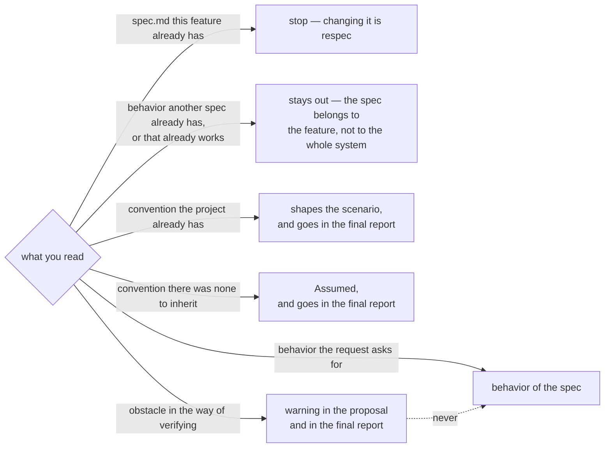
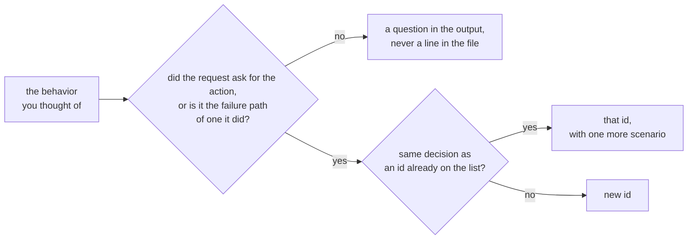
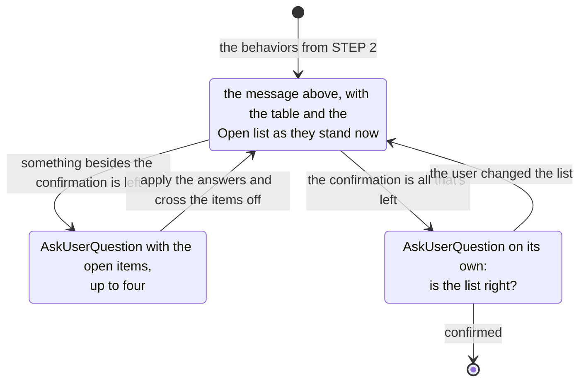

# spec — what the system does, in examples

Artifact skeleton: `TEMPLATE.md`, next to this file. Copy it and fill it in.

**The only artifact you write is `spec.md`** — one per `feature`, and nothing else. No plan,
no task list, no code.

**Missing decisions don't get settled here.** They go under `Assumed`, and the one that stops
at each of them is `/my-spec:clarify`, later.

**`--assume` in the request drops the stop in STEP 3.** At every fork you take the most
likely value, put it under `Assumed` and carry it to the final report — which then becomes
the first time the user sees the list of `behaviors`.

**It drops a question, never a stop.** An empty call, a `spec.md` already written and an empty
list of `behaviors` all end the run exactly the same with the flag as without it — they are
ends of work, not forks, and there is nothing there to assume. A flag that reads like
permission to go ahead is the one you most want to run a stop with.

## Glossary

`feature`, `spec`, `behavior` and `scenario` are the framework's units; `Assumed` is a field
of the file. All five go in code font wherever they carry that meaning, so they don't blur
into the plain word sitting next to them.

**Two ids, two jobs.** The `behavior` is numbered `B1`, `B2` and the `scenario` `S1`, `S2`,
both permanent and both unique inside the `spec`. The `B` is the product decision — what
`respec` operates on, what the `Assumed` hangs under. The `S` is the unit that gets verified —
what a task and a test cite. One `behavior` with four `scenarios` is four tests, and citing
only the `B` would hide three of them from `check`.

**`feature`** — what one `spec` covers: the folder `specs/<feature>/`, and later the plan and
the tasks under that same name. It is the smallest set of product decisions the request
covers whose `scenarios` all close without reaching for something the `feature` itself
doesn't deliver — the `Given` aside, where leaning on a finished `feature` is the normal
case. It isn't the verb and it isn't the route: a CRUD for people is three `features`, while
creating something and reading back what was created is one, because the `Then` of the first
has to look at what the second serves.

What arrives in the request is whatever the user calls a feature, written by someone who may
not have settled yet on what they want. The `feature` above is the one you work it into, and
that one names the folder. The two often match and sometimes don't — and where they don't,
STEP 3 is where the user finds out which one you settled on.

**`spec`** — the `spec.md` file, one per `feature`, holding one or more `behaviors`. It is
permanent: tests and code cite ids from it, and those citations still hold long after the
`feature` closes. So it says nothing about design — layers, libraries, who generates the
identifier, where validation lives — and nothing about the order of the work. Both of those
change, and the `spec` can't change with them.

**`behavior`** — Gherkin's `Rule`: one product decision, numbered `B1`, `B2`, that a person sets off and can
see the result of: no action and no visible result means there's nothing to check, and if
only someone working inside the repository can see the difference, it isn't one. In the file
it's the section the id opens: a Gherkin block with one or more `scenarios`, and below it the
assumptions, under `Assumed`, if there were any. Two decisions are two `behaviors`, even when
the same action sets off both.

**`scenario`** — each block opened by the `Scenario` keyword inside a `behavior`. It's what a
person reads to check the `feature` and what a test verifies end to end against the real
system, with the literal value in the `Then`. It is numbered `S1`, `S2`, and the id opens its
name: `Scenario: S3 · rejects a malformed e-mail`. Two `scenarios` under one `behavior` are
two routes to the same decision — a different action, a different input, a different starting
state. A `Scenario Outline` is one `scenario` with several `Examples` rows, and counts as one:
one id, however many rows the table has.

**`Assumed`** — the field under a `behavior` holding the decision nobody made: a field's
limit, the order of a listing, what happens when you delete something that isn't there. It
doesn't say what happens, since the `Then` already does — it says nobody chose it. It's the
only part of the file meant to disappear: `clarify` stops at each line, and the answer that
settles one deletes it. A `spec.md` with no `Assumed` left is a clarified one. It isn't
numbered and nothing cites it.

## STEP 1 — READ

1. **The request** — the call's argument, and nothing else. **An empty call ends the step
   right here**: ask for the request in writing and stop, with no table, no questions and no
   file. `--assume` doesn't stand in for it — the flag drops a question, it doesn't supply the
   request.

   What was said earlier in the conversation doesn't count. That text was written to explore:
   it changed direction, part of it was dropped, and none of it was written to become a
   permanent file. Writing the request out costs the user one line and is them signing it. You
   tend to read reusing what was just said as being helpful, and what it actually does is
   specify a `feature` nobody asked for in those words.

   **A `--flag` you don't recognize ends the call the same way**, saying which one exists.
   `--assume` is the only one. A typo in it — `--asume` — would otherwise ride along as part
   of the request and stop at STEP 3, which is the opposite of what was asked, with nothing
   said about why.
2. **The `spec.md` the request lands on**, in `specs/`, before anything else is read. If it's
   there, the step ends and nothing below gets read: all of it is work on a `feature` you
   aren't going to write. Right after this list is why it stops.
3. **The project's conventions** — `CLAUDE.md` or a conventions file. Failing that, pull them
   from the repository: language, the shape of error responses, what the system already does
   in a similar spot. An empty project has nothing to inherit, so pick — the first `feature`
   sets the convention for every one after it, and the user confirms that now instead of
   finding out six `features` later.
4. **The `specs` and the repository** — to see what's already there: a `behavior` specified in
   another `spec`, or one that already works and nobody's going to touch.
5. **Anything that blocks verification** — a dependency that blocks every call, a setting
   without which the app won't start, a file that won't compile. With one of those in the
   way, no `scenario` can be verified and the whole list is just a promise.

   **You only read, you never run.** Report only what reading can tell you: failing tests and
   broken builds only show up for the person who runs them, and you won't be running
   anything.

**A `feature` that already has a `spec.md` is not yours to rewrite, and the step ends at item
2.** Say what the file already covers and which part of it the request lands on, and say that
changing it is `/my-spec:respec`. Filling in `TEMPLATE.md` over it renumbers every id from
`B1`, and the tests citing those ids were pointing at the old ones — it is the one mistake
here that breaks tests that were passing. You tend to hand over the artifact you were called
for even when it is already written.

Where everything you read ends up, and the one path that doesn't exist:



**The drawings in this skill are here for the user to check at a glance, and none of them
goes into `spec.md`** — `TEMPLATE.md` has no diagrams at all. For you they're rules like the
rest of the step. Inside a drawing the terms go without backticks, since there's no markdown
to render there.

**An obstacle never turns into a `behavior`.** If nobody asked for authentication,
"authenticate before creating" isn't a product decision — it's you working around the
obstacle, and that workaround stays forever in a file the tests cite.

## STEP 2 — WORK OUT THE BEHAVIORS

**An empty list doesn't become a `spec`, and the step ends right here.** Adding a folder to
`.gitignore`, bumping a dependency, reformatting code, renaming a file — nobody using the
system sets any of that off, and the whole request can look like this:

````markdown
No behaviors — there's no spec to write.

Adding `dist/` to `.gitignore` changes the repository, not the product: nobody using the
system sets it off, and the difference only shows up for people working in here. The one
scenario you could write would end in `Then dist doesn't show up in git status`, which checks
the command, not the application.

It's just work to do, and it doesn't go through here.
````

No questions, no file, and no call to `clarify` — there's no `spec` to approve. If part of
the request had product in it and part didn't, write the `spec` for the part that did and
report the rest in the same breath. Once you've been called, you tend to hand over the
artifact the command's name promises, and that's how a `Scenario` about `git status` lands in
a permanent file the tests will cite.

**One id per decision, not per action.** Rejecting an invalid name on create and on rename is
the same decision in two places: one id, two `scenarios`. The different action is what jumps
out at you, and that's why you split too much.

**Write the failure paths along with the one that works** — invalid input, something that
isn't there, an impossible state, the same call twice. Nobody asks for these, and they're
what decides the product: the request says "create a board", and without them you're left
with a system that takes anything.

**Stop where the request stops.** You see "create an invite" and finish the pattern:
expiration, use limits, revoking, notifications. Each one looks obvious and none of them was
asked for. Written down, the `behavior` turns into code without anyone deciding the product
has it. Where the line falls: rejecting invalid input is the same `feature`; expiring an
invite is a different one.

The two decisions, in the order you make them:



## STEP 3 — PROPOSE AND STOP

One line per `behavior`, with no `scenarios` at all:

````markdown
## create invite — 5 behaviors

`specs/create-invite/`

| id | behavior |
|----|----------|
| `B1` | create an invite for an e-mail address |
| `B2` | reject a malformed e-mail |
| `B3` | accept an invite by its code |
| `B4` | reject a code that isn't there |
| `B5` | list the invites someone sent |

**Warning** — an authentication dependency is already in the project and answers 401 to every
request. While that holds, none of the behaviors above can be verified.

**Open**

1. is `B5` the listing spec that already exists?
2. expiration and revoking weren't in the request — are they in?
3. is the list right?
````

**The table is the list the user reviews; `Open` is where the cycle stands.** An item on the
list is a question the user hasn't answered yet, and an empty list ends the step. A question
about one `behavior` names its id; a question about the whole thing — what stays out,
splitting into `specs` — names none. **`is the list right?` shows up with the list and is the
last item to leave it.**

**Ask what changes the table, and nothing else.** Four questions belong here, and each one is
answered by editing a line: does it go in or stay out, is it one decision or two, does this
already exist somewhere else, is this one `feature` or two `specs`. A question that changes
the wording of a `Then` — the error code, the order of a listing, a field's limit — doesn't
belong here: it becomes `Assumed` in STEP 4, and `clarify` is what asks it. You tend to want
everything settled while the user is right there, and then they decide the whole product
before seeing a single `scenario`.

**Questions go in the option selector, not in the text** — an `AskUserQuestion` call right
after the message, one question per open item. The table and the warning stay where they are,
since they don't fit in an option label. A question written in prose gets answered in prose,
if it gets answered at all; and you tend to carry on writing the file as if it had been.

**The list comes out whole every round; the selector is a slice of it.** An item that didn't
become a question stays written down — that's how it survives the rounds without depending on
you to remember it. Anything past four waits for the next round.

**`is the list right?` never shares a selector with another question.** It's an
`AskUserQuestion` call of its own, one question, and it happens once nothing else is open. You
tend to save yourself a round and send everything at once, and then the user approves the list
in the same answer where they ask you to change it: they confirmed before seeing what their
own answer changed. Two calls in a row cost one round; a list approved before anyone saw it
finished costs the whole step.

**Each round, ask "has this been answered?", never "am I still unsure about it?".** Being
unsure is your own judgment, and your own judgment can't hold a cycle open: all it takes is
you feeling sure for the list to come out empty, and the step ends with a table nobody
approved. The other items are things you noticed; **the confirmation is the one that doesn't
depend on noticing** — it starts on the list and only the user takes it off.

**Once answered, an item leaves the list.** Whatever stayed out doesn't become a row in the
table and drops off here, but keep it for the STEP 5 report. An item that outlives its own
answer is a round that repeats itself.

**The step is a cycle, not a question:**



**The only way out of the cycle is that confirmation**, and you only ask it once nothing else
is open. You tend to treat the first call as the rule met and move on to STEP 4 — and then
the corrected list is never seen by the person who asked for the correction.

**Don't raise a decision just to have something to ask**: a new item only goes in if an answer
opened one. Otherwise the list never empties.

**A long list splits into `specs`, never in half.** Twenty `behaviors` almost always mean
there's more than one `feature` in there: a CRUD for people is registering, looking up and
removing, and each one gets its own folder with its own whole `spec`. Say where the split
falls and ask; if the user says it's a single `feature`, write all twenty. What doesn't
exist is half a `spec` — whatever stayed out would be specified nowhere, and picking what gets built
first is the `tasks` job, not this one.

**Once the split is confirmed, you write every one of them.** Whoever asked for a CRUD asked
for the three; handing over one and reporting the other two leaves most of the request
specified nowhere, which is the same thing the paragraph above forbids. What changes is small:

- **one table per `spec`**, each under its own folder name, in the one message;
- **a question that names an id names the folder with it** — `create-invite:B3`. Each table
  numbers from its own `B1`, so a bare `B3` points at three rows at once;
- **the confirmation goes plural**, `are the lists right?`, and it is still one call alone in
  its selector. What the user is confirming is the split, and the split is the whole set of
  tables — one confirmation per table asks the same question three times;
- STEP 4 writes one file per table and STEP 5 reports one line per file.

### The folder

**`specs/<short-name>/`** — two to four words in kebab-case: `specs/create-invite/`. The name
comes from the request, action-noun where that reads well, and a technical term or an acronym
keeps its own spelling — `oauth2-api-integration`, not `oauth-two-api-integration`. The
language is the project's, the same one the step text will be in.

**The name shows up in the message above, and the confirmation covers it.** The folder is
permanent — the plan and the tasks live in it — so renaming it later means moving files that
other files point at. Where its shape comes from: `specs/conventions.md`, once `init` has
settled it there; the paragraph above, while there is none.

**Stop here, and only here.** Getting the list right costs a line per item; getting it wrong
costs fifteen `scenarios` thrown away. With `--assume`, this step's message doesn't even
exist: go straight to STEP 4 and let the list turn up in the final report.

## STEP 4 — FILL IN THE TEMPLATE

a `spec.md` inside each folder STEP 3 settled, from `TEMPLATE.md`. Anything left over from the skeleton gets
deleted: brackets you didn't fill in, an empty section, and the italic label saying when the
field applies — that one is an instruction for you, not part of the artifact. The skeleton
shows two `behaviors` and two shapes of `scenario`; your `feature` has however many it has.

### The shape of the file

**It is a `.feature` written in markdown**, one construct to one construct: the `#` is
`Feature:`, the summary under it is that feature's free-form description, each `## B` is a
`Rule:`, and each fenced block is one `Scenario` or `Scenario Outline`. Inside the block
everything Gherkin has is yours — `And`, `But`, `*`, doc strings, data tables, more than one
`Examples` section.

**Nobody converts the file, and no project here runs Gherkin.** The shape is there so what
you write has a structure someone else defined instead of one you invented on the spot: the
pull is to add a heading for context, a table of contents, a section of notes, and each of
those is a piece of the artifact that no `.feature` could hold.

Three constructs stay out. **`Background`** — a `scenario` is cited on its own by a task and
by a test, so its starting state has to be readable right there; the `Given` repeats instead.
**Tags** — nothing is executed, so there is nothing to filter, and the id already opens the
name. **The `# language:` header and comments** — the keywords are always English, and a
comment is prose in an artifact that has markdown for prose.

`Assumed` is the one field with no counterpart in Gherkin, and markdown is where it belongs:
it is the only line in the file meant to disappear.

### The scenario

**Keywords in English, step text in the project's language.** `Scenario`, `Given`, `When`,
`Then`, `And`, `Scenario Outline` and `Examples` are the structure, the same in every project,
and the keyword is the name of the unit itself. What a person reads to check the `feature` is
the step text, and that's in their language — the examples in this file are in English because
this file is, not because the artifact has to be. Trading the step text for syntax
highlighting is a bad deal.

**Write text, not code.** The framework doesn't assume anything that runs Gherkin — whoever
installs this may never have touched Cucumber. On the other side there's a test written in
the project's own technology, and that test is what verifies the `scenario`.

**Write for a test with no fakes in it.** Real database, real request, the scene loaded. If a
`scenario` only passes with half the system mocked out, it doesn't check what it promises.
`Then I get the invite e-mail` puts an e-mail server in the test — which doesn't rule the
`scenario` out, but sometimes shows that the right thing to look at is something else: the
message on the queue, the row in the table.

**Write the value, don't describe it.** `I get 201 with Location: /invites/{code}`, not "I
get the right response" — describing the result instead of writing it lets the check pass on
anything.

**Where time, frames or physics come into it, the result is a range:** `the door finishes
opening in under a second`, never `it opens in exactly 0.5s`. An exact number there fails on
someone else's machine, and the person checking learns to ignore it.

**The `Given` is the starting state, and it only shows up when that isn't the project's
default.** In a backend it usually disappears, since the default is an empty database; in a
game, `the enemy 10 meters from the player` is what decides whether what the person saw was
what they should have seen.

A `behavior` with several inputs becomes a `Scenario Outline` with an `Examples` table.

### Assumed

**Never invent a missing decision in silence.** Take the most likely value, put it under
`Assumed` below the `behavior` that used it, and carry the same line to the output. Skip that
and a product decision lands in the system with nobody having decided anything.

**A convention you picked because there was none to inherit goes here**, under the first
`behavior` that used it — repeated under each one it's just noise. A convention inherited from
the repository doesn't go in: it has an owner outside the `spec` and it changes without the
`feature` changing, and the `spec` can't change with it.

Write the line even when the `scenario` already shows the value. A long list is a signal, not
clutter — don't merge or summarize to keep the field short. And don't write down what the
`feature` left out: "the invite has no use limit" is a `behavior` of a `feature` that doesn't
exist, and putting it here is that `feature`'s first appearance in the system.

### Ids

`B1`, `B2`… and `S1`, `S2`… in the order they appear in the file. **The numbering is fixed
here, not in STEP 3** — the table renumbers freely, since nothing cites an id yet. Both series
are unique inside one file and start over in the next: after a split, every `spec` opens at
`B1` and `S1`, and `create-invite:B3` is what tells two of them apart.

**The `S` runs through the whole file and doesn't restart under each `behavior`.** `B2`'s
first `scenario` is `S3` if `B1` had two. Numbering `B2.S1` would say twice where the
`scenario` sits, and one of the two copies goes stale the day it moves to another `behavior`.

Once the file is written, **numbers are never reused, in either series:** an id you remove
stays empty forever, since some test may cite that number — and the replacement comes in with
the next free id, even when it belongs in the middle of the file.

## STEP 5 — REPORT

The file, and then what it doesn't show:

````markdown
`specs/create-invite/spec.md` — 5 behaviors, 9 scenarios.

**Warning** — the authentication dependency answers 401 to every request, and until that
changes no scenario here can be verified.

**Product decisions still missing** — the assumed value is already in the file, and changing
it means editing one line of the `Then`:

- the order of the listing (assumed newest first)
- accepting the same invite twice (assumed 409)

**Followed the repository's convention** — creating answers 201 with `Location`, and the body
repeats what was created.

**Left out** — expiration and revoking, which weren't in the request.

**Expensive to check** — `S1` ends with an e-mail delivered, which asks for an e-mail server
in the test. It could stop at the message on the queue.

Run `/my-spec:clarify` to settle the 2 assumptions.
````

**That last line always goes in**, pending assumptions or not: `clarify` is also where the
`spec` gets approved.

**After a split, the first line becomes one line per file**, and anything further down that
belongs to a single one of them says which — `create-invite:S1`, the same notation STEP 3
used. The `clarify` line names the folders, since it runs on one `spec` at a time.

With `--assume`, say in the first line that it ran that way — the folder name and the list of
`behaviors` were both settled without asking. The name still follows the rule in STEP 3; what
it skips is the confirmation.

**Only what you actually found.** A bold label looks like a mandatory section, and a section
that shows up every time — sometimes only to say there's nothing — teaches the user to skip
the whole bottom half. Give the count without passing judgment on it.
