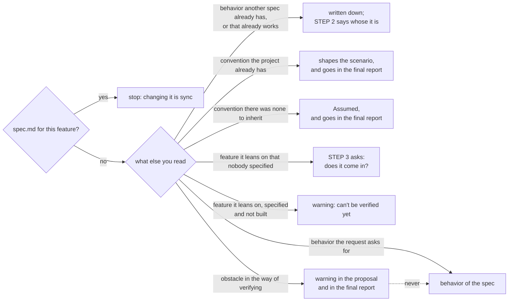
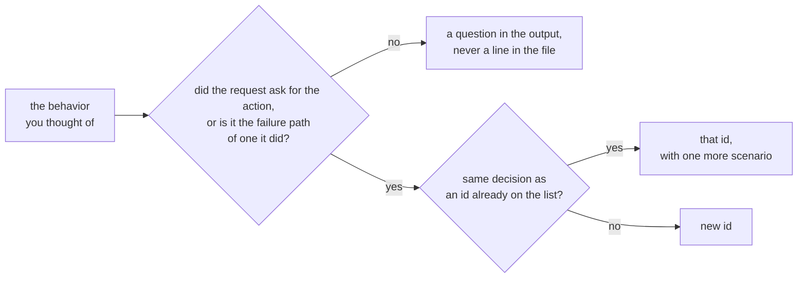
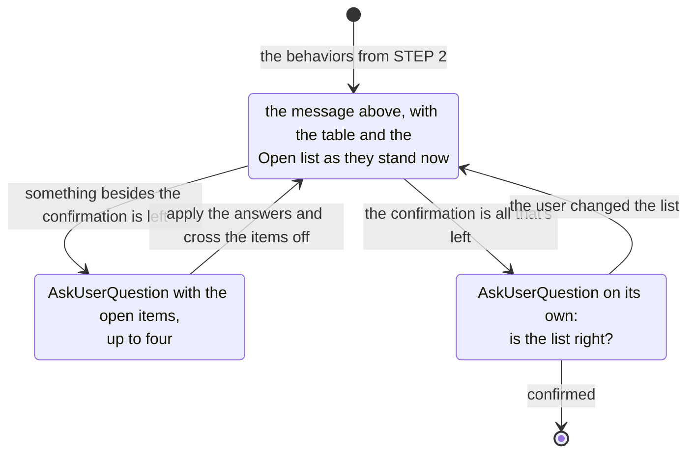

# spec: what the system does, in examples

Artifact skeleton: `TEMPLATE.md`, next to this file. Copy it and fill it in.

Every rule here carries an id, `R1`, `R2`, permanent and never reused. It is what a test case
cites and what makes coverage arithmetic instead of a reread. The glossary has none: it
defines, it doesn't order.

The word after the id says where the rule leaves its mark, which is where a case has to look
to see whether it was followed: `artifact` in what gets written to disk, `run` in whether the
run ends early and in how many files come out, `dialogue` in what the user is shown and
asked, `trace` in the `▸ ▪ ↳ ◂` lines and nowhere else.

**R1 · artifact · The only artifact you write is `spec.md`**, one per `feature`, and nothing
else. No plan, no task list, no code.

**R2 · artifact · Missing decisions don't get settled in the `spec`.** They go under
`Assumed`, and the one that stops at each of them is `/my-spec:clarify`, later.

**R3 · dialogue · `--assume` in the request drops the STEP 3 message**: no table, no
questions, no confirmation. Every fork you would have asked about you settle on your own, the
cut into more than one `spec` among them, and a value nobody chose goes where R53 already puts
it. The one fork you don't settle is a `feature` the request presupposes and nobody specified:
it doesn't become a `spec` of its own, it stays a line in the report.

**R4 · run · `--assume` drops a question, never an end of work.** An empty call, a request that
names no subject, a `spec.md` already written and an empty list of `behaviors` all finish
exactly the same with the flag as without it: there is no fork at any of them, and nothing to
assume. Assuming what `crud` is a crud of invents the whole product, not a value in a `Then`.
A flag that reads like permission to go ahead is the one you most want to run those with.

## The trace

A run, read from the outside:

```
▸ STEP 1: READ · conventions, the other specs and the repository
◂ STEP 1 · no spec.md for it, 201 with Location is the convention, auth answers 401
▸ STEP 3: PROPOSE · 5 behaviors on the table
▪ STEP 3 · round 1 · 3 open items
▪ STEP 3 · round 2 · the confirmation on its own
◂ STEP 3 · 5 behaviors confirmed, specs/create-invite/
▸ STEP 4: TEMPLATE · writing specs/create-invite/spec.md
```

**R5 · trace · Every step has an `In` and an `Out`, in the two lines under its heading, and
you announce both in the conversation**, one line going in, one coming out. `▸` opens the step
with what it is about to do, and `◂` closes it with its `Out`, filled in with what actually
came out. You tend to work in silence and hand over the finished artifact, and then a run that
stopped halfway looks exactly like one that went through all five steps.

**R6 · trace · A step that is a cycle emits one `▪` per round, numbered, between its `▸` and
its `◂`.** The step is entered once and left once, however many rounds it takes: a `▸` per
round would make a cycle indistinguishable from four steps in a row. Leaving STEP 3 on the
first round is the defect that costs the most here, and counting the `▪` is what makes it
visible from the outside.

**R7 · trace · A stop is an `Out`, not a failure.** STEP 1 and STEP 2 each declare one, and
the `◂` comes right before the stop message: it is what says which of the checks the run died
on.

**R8 · trace · The `Out` is one line, and it is never a file.** You tend to hand over what you
produced as an artifact (`spec.md` is still the only one you write) and to grow the line into
a section of the report. STEP 5 says what the file holds; the trace says where you were.

**R9 · artifact · None of the `▸`, `▪`, `↳` and `◂` lines goes into `spec.md`, and neither do
`In` and `Out`.** They are the step's contract and say where the run was; the file has no such
field, and it is what outlives the run.

**R64 · trace · `--verbose` in the request makes the rule that decided in silence announce
itself**, with `↳`, between the step's `▸` and its `◂`, one line per decision carrying the id
and what it decided:

```
▸ STEP 2: WORK OUT THE BEHAVIORS · the list, from what STEP 1 read
↳ R22 · rejecting an invalid name on create and on rename: one id, two scenarios
◂ STEP 2 · 5 behaviors
▸ STEP 3: PROPOSE · 5 behaviors on the table
↳ R28 · B3 leans on what B1 creates, and this spec delivers both: not asked
```

The flag narrates and decides nothing: a run with it and a run without it hand over the same
`spec.md`, ask the same questions and stop at the same places. You tend to read a flag asking
for detail as a flag asking for care, and then the same request specifies a different product
depending on how it was typed.

**R65 · trace · A decision anyone can find somewhere else doesn't announce itself.** `R31` is
an `AskUserQuestion` call sitting in the conversation, `R41` and `R54` are in the file, `R24`
and `R63` are already the **Left out** line of the STEP 5 report, `R16` is a command nobody
ran: citing them buys the reader nothing and buries the lines that are worth something. Two
kinds are worth a line, and both are decisions nobody could reconstruct afterwards from the
file or from the report: **an id you didn't open**, where what could have been two `behaviors`
came out as one (`R22`), and **a question you didn't ask** (`R28`). And only what you decided
in this run: a rule you read and moved past has nothing to report. You tend to cite the
structural rule, which is the easy one to name, and then the run reports five rules the user
could have checked without you.

**R66 · dialogue · Without `--verbose` no rule id shows up anywhere**: not in the trace, not
in the STEP 3 message, not in the report, not in a stop, not in an answer you give along the
way. And not
the paraphrase either, *the rule says expiration stays out* being the same citation with the
number filed off. The user asked for the `spec` of a `feature` and has never read this file:
`R24` points at nothing they can open, and it reads like the system explaining itself instead
of handing over what was asked. Say the decision on its own, the way the STEP 5 report already
does: *expiration and revoking weren't in the request*. With the flag the ids live on the `↳`
lines and nowhere else.

## Glossary

`feature`, `spec`, `behavior` and `scenario` are the framework's units; `Assumed` is a field
of the file. All five go in code font wherever they carry that meaning, so they don't blur
into the plain word sitting next to them.

**Two ids, two jobs.** The `behavior` is numbered `B1`, `B2` and the `scenario` `S1`, `S2`,
both permanent and both unique inside the `spec`. The `B` is the product decision: what
`sync` operates on, what the `Assumed` hangs under. The `S` is the unit that gets verified,
what a task and a test cite. One `behavior` with four `scenarios` is four tests, and citing
only the `B` would hide three of them from `check`.

**`feature`** is what one `spec` covers: the folder `specs/<short-name>/`, and later the plan
and the tasks under that same name. It is the smallest set of product decisions the request
covers whose `scenarios` all close without reaching for something the `feature` itself
doesn't deliver, the `Given` aside, where leaning on a finished `feature` is the normal
case. It isn't the verb and it isn't the route: a CRUD for people is three `features`, while
creating something and reading back what was created is one, because the `Then` of the first
has to look at what the second serves.

What arrives in the request is whatever the user calls a feature, written by someone who may
not have settled yet on what they want. The `feature` above is the one you work it into, and
that one names the folder. The two often match and sometimes don't, and where they don't,
STEP 3 is where the user finds out which one you settled on.

**`spec`** is the `spec.md` file, one per `feature`, holding one or more `behaviors`. It is
permanent: tests and code cite ids from it, and those citations still hold long after the
`feature` closes. So it says nothing about design (layers, libraries, who generates the
identifier, where validation lives) and nothing about the order of the work. Both of those
change, and the `spec` can't change with them.

**`behavior`** is Gherkin's `Rule`: one product decision, numbered `B1`, `B2`, that a person sets
off and can see the result of: no action and no visible result means there's nothing to check,
and if only someone working inside the repository can see the difference, it isn't one. In the
file it's the section the id opens: a Gherkin block with one or more `scenarios`, and below it
the assumptions, under `Assumed`, if there were any. Two decisions are two `behaviors`, even
when the same action sets off both.

**`scenario`** is each block opened by the `Scenario` keyword inside a `behavior`. It's what a
person reads to check the `feature` and what a test verifies end to end against the real
system, with the literal value in the `Then`. It is numbered `S1`, `S2`, and the id opens its
name: `Scenario: S3 · rejects a malformed e-mail`. Two `scenarios` under one `behavior` are
two routes to the same decision: a different action, a different input, a different starting
state. A `Scenario Outline` is one `scenario` with several `Examples` rows, and counts as one:
one id, however many rows the table has.

**`Assumed`** is the field under a `behavior` holding the decision nobody made: a field's
limit, the order of a listing, what happens when you delete something that isn't there. It
doesn't say what happens, since the `Then` already does, it says nobody chose it. It's the
only part of the file meant to disappear: `clarify` stops at each line, and the answer that
settles one deletes it. A `spec.md` with no `Assumed` left is a clarified one. It isn't
numbered and nothing cites it.

## STEP 1: READ

`In` · the call's argument, and nothing else.

`Out` · the request, the project's conventions, what already exists around it and the
obstacles in the way of verifying, or a stop.

**R10 · The request is the call's argument, and nothing else, and an empty call ends the step
right here.** Ask for the request in writing and stop, with no table, no questions and no
file.

What was said earlier in the conversation doesn't count. That text was written to explore: it
changed direction, part of it was dropped, and none of it was written to become a permanent
file. Writing the request out costs the user one line and is them signing it. You tend to read
reusing what was just said as being helpful, and what it actually does is specify a `feature`
nobody asked for in those words.

**R67 · A request that names an operation without naming what it operates on ends the step the
same way an empty call does**: `crud`, `a listing screen`, `an endpoint`, `a migration`. Say
what is missing, ask for the request in writing and stop.

The test is the folder R38 asks for, and it costs one line to run: the shortest name that
tells this `feature` apart from the others under `specs/`. `crud` gives you `specs/crud/`,
which distinguishes nothing, and the word that would distinguish it is the one that wasn't
said. `crud of boards` passes and so does `create an invite`.

You tend to fill the missing noun in from whatever is nearby, the last thing in the
conversation or the only entity in the repository, and R10 has already ruled both of those
out. What that produces is not a visible error: it is a plausible `spec.md` for a `feature`
nobody asked for, permanent and cited by tests.

**R68 · An incomplete request is not this, and it goes through.** `create an invite` says
nothing about expiration, about the shape of the code or about who is allowed to invite, and
that is the ordinary case: the failure paths are R23, the values nobody chose are `Assumed`,
and STEP 3 is where the list gets corrected. What R67 stops is the request with no subject in
it, which no question in STEP 3 could recover, since R26 asks what changes the table and there
is no table to change.

**R11 · A `--flag` you don't recognize ends the call the same way**, saying which ones exist.
There are two, `--assume` and `--verbose`, and one call takes both. A typo in either
(`--asume`) would otherwise ride along as part of the request and stop at STEP 3, which is the
opposite of what was asked, with nothing said about why.

The four readings, in this order:

**R12 · Read `specs/` before anything else, and read it for one question: does the `feature`
this request lands in already have a `spec`?** Not whether some `spec` covers the request: a
Boards `spec` holding create and list is where deleting a board belongs, and opening
`specs/delete-board/` instead splits one `feature` across two files, each with its own `B1`.
The conventions, what surrounds the request and the obstacles are only worth reading for a
`feature` you're going to write.

**R13 · Read the project's conventions in `specs/conventions.md` or `CLAUDE.md`**, and failing
those in the repository: language, the shape of error responses, what the system already does
in a similar spot. `specs/conventions.md` is `init`'s file, numbered `C1`, `C2`,
and it wins where the two disagree: it was written for this, and `CLAUDE.md` is whatever the
project already had. An empty project has nothing to inherit, so pick. The first `feature`
sets the convention for every one after it, and the user confirms that now instead of finding
out six `features` later.

**R14 · Read the other `specs` and the repository for what surrounds the request, and write
down what you find without ruling on it**: a `behavior` another `spec` covers, one that already
works and nobody's going to touch, and whether what the request leans on exists at all. Say
what it is and where it lives, and stop there. Whose each one is decides between staying out of
the file and ending the run, and STEP 2 is where that falls, since the boundary only exists
once the list does: here you would be drawing it from a name and a domain.

**R15 · Read the repository for what blocks verification**: a dependency that blocks every
call, a setting without which the app won't start, a file that won't compile. With one of those
in the way, no `scenario` can be verified and the whole list is just a promise, so it becomes a
warning in the proposal and in the STEP 5 report.

**R16 · You only read, you never run.** Report only what reading can tell you: failing tests
and broken builds only show up for the person who runs them, and you won't be running
anything.

**R17 · A `feature` that already has a `spec.md` is not yours to rewrite, and STEP 1 ends the
moment the file turns up**, with nothing else read. Say what the file already covers
and which part of it the request lands on, and say
that changing it is `/my-spec:sync`. Filling in `TEMPLATE.md` over it renumbers every id
from `B1`, and the tests citing those ids were pointing at the old ones: it is the one
mistake here that breaks tests that were passing. You tend to hand over the artifact you were
called for even when it is already written.

Where everything you read ends up, and the one path that doesn't exist:



**R18 · The drawings in this skill are here for the user to check at a glance, and none of
them goes into `spec.md`**: `TEMPLATE.md` has no diagrams at all. For you they're rules like
the rest of the step. Inside a drawing the terms go without backticks, since there's no
markdown to render there.

**R19 · An obstacle never turns into a `behavior`.** If nobody asked for authentication,
"authenticate before creating" isn't a product decision, it's you working around the
obstacle, and that workaround stays forever in a file the tests cite.

## STEP 2: WORK OUT THE BEHAVIORS

`In` · everything STEP 1 read.

`Out` · one line per `behavior`, or an end of run: an empty list, or a list with a `behavior`
the system already delivers.

**R20 · An empty list of `behaviors` doesn't become a `spec`, and the step ends right
here.** Adding a folder
to `.gitignore`, bumping a dependency, reformatting code, renaming a file: nobody using the
system sets any of that off, and the whole request can look like this:

````markdown
No behaviors: there's no spec to write.

Adding `dist/` to `.gitignore` changes the repository, not the product: nobody using the
system sets it off, and the difference only shows up for people working in here. The one
scenario you could write would end in `Then dist doesn't show up in git status`, which checks
the command, not the application.

It's just work to do, and it doesn't go through here.
````

**R21 · An empty list of `behaviors` means no questions, no file and no call to `clarify`**:
there's no `spec` to approve. If
part of the request had product in it and part didn't, write the `spec` for the part that did
and report the rest in the same breath. Once you've been called, you tend to hand over the
artifact the command's name promises, and that's how a `Scenario` about `git status` lands in
a permanent file the tests will cite.

**R63 · What already works goes one of two ways, and the list is what tells them apart.** A
`behavior` of another `feature`, covered by its `spec` or just working, **stays out of this
`spec` and goes to the STEP 5 report**: the `spec` belongs to the `feature`, not to the whole
system. **One `behavior` of this `feature` that the system already delivers ends the run with
`/my-spec:sync`**, and it doesn't take every one of them: part of the `feature` was built by
hand and no `spec` covers it, so writing only what is left over hands back a permanent file
that describes a third of the `feature`, with the other two thirds specified nowhere. Name what
you found and where, and hand over `/my-spec:sync`, which takes in what exists and the request
along with it. Boards with create and list already answering, and a request for delete, is
this case whole.

Compare `behavior` by `behavior` inside the `feature` you are delimiting, never the request
against whatever resembles it: "invite by public link" next to an existing invite by email
shares a name and a domain and delivers not one `behavior` of what was asked, so the run goes
on. Where this differs from an empty list: there the request had no product in it, here it has
product and part of it is already standing.

**R22 · One id per decision, not per action.** Rejecting an invalid name on create and on
rename is the same decision in two places: one id, two `scenarios`. The different action is
what jumps out at you, and that's why you split too much.

**R23 · Write the failure paths along with the one that works**: invalid input, something
that isn't there, an impossible state, the same call twice. Nobody asks for these, and they're
what decides the product: the request says "create a board", and without them you're left
with a system that takes anything.

**R24 · Stop where the request stops.** You see "create an invite" and finish the pattern:
expiration, use limits, revoking, notifications. Each one looks obvious and none of them was
asked for. Written down, the `behavior` turns into code without anyone deciding the product
has it. Where the line falls: rejecting invalid input is the same `feature`; expiring an
invite is a different one.

The two decisions, in the order you make them:



## STEP 3: PROPOSE AND STOP

`In` · the list from STEP 2.

`Out` · that list confirmed and the folder name, one of each per `spec`, after a split.

One line per `behavior`, with no `scenarios` at all:

````markdown
## create invite: 5 behaviors

`specs/create-invite/`

| id | behavior |
|----|----------|
| `B1` | create an invite for an e-mail address |
| `B2` | reject a malformed e-mail |
| `B3` | accept an invite by its code |
| `B4` | reject a code that isn't there |
| `B5` | list the invites someone sent |

**Warning**: an authentication dependency is already in the project and answers 401 to every
request. While that holds, none of the behaviors above can be verified.

**Open**

1. is `B5` the listing spec that already exists?
2. expiration and revoking weren't in the request. are they in?
3. is the list right?
````

**R25 · The table is the list the user reviews; `Open` is where the cycle stands.** An item on
the list is a question the user hasn't answered yet, and an empty list ends the step. A
question about one `behavior` names its id; a question about the whole thing (what stays out,
splitting into `specs`) names none. **`is the list right?` shows up with the list and is the
last item to leave it.**

**R26 · Ask what changes the table, and nothing else.** Five questions belong here, and each
one is answered by editing a line: does it go in or stay out, is it one decision or two, does
this already exist somewhere else, is this one `feature` or two `specs`, and does it lean on a
`feature` nobody specified. A
question that changes the wording of a `Then` (the error code, the order of a listing, a
field's limit) doesn't belong here: it becomes `Assumed` in STEP 4, and `clarify` is what
asks it. You tend to want everything settled while the user is right there, and then they
decide the whole product before seeing a single `scenario`.

**R27 · A `behavior` that presupposes a `feature` nobody has specified is asked while the
table is still open and nothing is written yet.** A CRUD
for columns presupposes boards; if no `spec` covers boards and no code does either, ask
whether boards come along: *columns presuppose boards, which no `spec` covers. do boards
come in?*. Answered yes, it is a split, and this step already knows what to do with one.
Answered no, it stops being a question and becomes a line in the STEP 5 report, with the user
having decided knowing what it costs.

**R28 · Don't ask when the dependency is already specified.** Somebody has decided it exists,
and what is left is the order the work gets done, which is the `tasks` job. Don't ask either
when the `feature` itself delivers it: `B3` needing what `B1` creates is the ordinary shape of
a `spec`. And never turn any of it into a stop: specifying isn't building, the `spec.md`
comes out correct either way, and the user is the one who knows whether that dependency is
with somebody else, due next sprint, or already live in another system.

**R29 · Questions go in the option selector, not in the text**: an `AskUserQuestion` call
right after the message, one question per open item. The table and the warning stay where they
are, since they don't fit in an option label. A question written in prose gets answered in
prose, if it gets answered at all; and you tend to carry on writing the file as if it had been.

**R30 · The `Open` list comes out whole every round; the selector is a slice of it.** An
item that didn't become a question stays written down: that's how it survives the rounds without
depending on you to remember it. Anything past four waits for the next round.

**R31 · `is the list right?` never shares a selector with another question.** It's an
`AskUserQuestion` call of its own, one question, and it happens once nothing else is open. You
tend to save yourself a round and send everything at once, and then the user approves the list
in the same answer where they ask you to change it: they confirmed before seeing what their
own answer changed. Two calls in a row cost one round; a list approved before anyone saw it
finished costs the whole step.

**R32 · Each round, ask "has this been answered?", never "am I still unsure about it?".** Being
unsure is your own judgment, and your own judgment can't hold a cycle open: all it takes is
you feeling sure for the list to come out empty, and the step ends with a table nobody
approved. The other items are things you noticed; **the confirmation is the one that doesn't
depend on noticing**: it starts on the list and only the user takes it off.

**R33 · An item leaves the `Open` list once its answer is applied to the table.** A `behavior`
the user answered out doesn't become a row and leaves the list with the rest, but it is carried
to the STEP 5 report. `is the list right?` answered with a change is the one item that stays:
the change reopens the table, and the confirmation is about the table as it ends up. An item
that outlives its own answer is a round that repeats itself.

**The step is a cycle, not a question:**



**R34 · The only way out of the cycle is the `is the list right?` confirmation**, and you only
ask it once nothing else is open. You tend to treat the first call as the rule met and move on
to STEP 4, and then the corrected list is never seen by the person who asked for the
correction.

**R35 · Don't raise a decision just to have something to ask**: a new item only goes in if an
answer opened one. Otherwise the list never empties.

**R36 · A long list splits into `specs`, never in half.** Twenty `behaviors` almost always mean
there's more than one `feature` in there: a CRUD for people is registering, looking up and
removing, and each one gets its own folder with its own whole `spec`. Say where the split
falls and ask; if the user says it's a single `feature`, write all twenty. What doesn't
exist is half a `spec`: whatever stayed out would be specified nowhere, and picking what gets built
first is the `tasks` job, not this one.

**R37 · Once the split is confirmed, you write every `spec` in it.** Whoever asked for a CRUD
asked for the three; handing over one and reporting the other two leaves most of the request
specified nowhere, which is the same thing the paragraph above forbids. What changes is small:

- **one table per `spec`**, each under its own folder name, in the one message;
- **a question that names an id names the folder with it**, as in `create-invite:B3`. Each table
  numbers from its own `B1`, so a bare `B3` points at three rows at once;
- **the confirmation goes plural**, `are the lists right?`, and it is still one call alone in
  its selector. What the user is confirming is the split, and the split is the whole set of
  tables: one confirmation per table asks the same question three times;
- STEP 4 writes one file per table and STEP 5 reports one line per file.

### The folder

**R38 · The folder is `specs/<short-name>/`**, kebab-case, and the shortest name that still
tells this `feature` apart from the others under `specs/`: `specs/create-invite/`. The name
comes from the request, action-noun where that reads well, and a technical term or an acronym
keeps its own spelling: `oauth2-api-integration`, not `oauth-two-api-integration`. A word that
distinguishes nothing doesn't earn its place, the project's own name and `api`, `feature` or
`module` among them. The name is in English: the folder is structure, and
`specs/create-invite/` reads the same in every repository.

**R39 · The folder name shows up in the STEP 3 message, and the confirmation covers it.** It is
permanent (the plan and the tasks live in it), so renaming it later means moving files that
other files point at. Where its shape comes from: `specs/conventions.md`, once `init` has
settled it there; the paragraph above, while there is none.

**R40 · STEP 3 is the only place where you wait on the user.** Getting the list right costs a
line per item; getting it wrong costs fifteen `scenarios` thrown away. STEP 4 and STEP 5 ask
nothing and confirm nothing: the finished `spec` is approved in `clarify`. With `--assume`,
this step's message doesn't even exist: go straight to STEP 4 and let the list turn up in the
final report.

## STEP 4: FILL IN THE TEMPLATE

`In` · the confirmed list and the folders from STEP 3.

`Out` · one `spec.md` written per folder, ids fixed, `Assumed` in place.

**R41 ·** Write a `spec.md` inside each folder STEP 3 settled, copied from `TEMPLATE.md`.
Anything left over from the skeleton gets deleted: brackets you didn't fill in, an empty
section, and the italic label saying when the field applies, which is an instruction for
you, not part of the artifact. The skeleton shows two `behaviors` and two shapes of
`scenario`; your `feature` has however many it has.

### The shape of the file

**R42 · `spec.md` is a `.feature` written in markdown**, one construct to one construct: the
`#` is `Feature:`, the summary under it is that feature's free-form description, each `## B` is a
`Rule:`, and each fenced block is one `Scenario` or `Scenario Outline`. Inside the block
everything Gherkin has is yours: `And`, `But`, `*`, doc strings, data tables, more than one
`Examples` section.

**R43 · Nobody converts `spec.md`, and no project here runs Gherkin.** The shape is there so
what you write has a structure someone else defined instead of one you invented on the spot:
the pull is to add a heading for context, a table of contents, a section of notes, and each of
those is a piece of the artifact that no `.feature` could hold.

**R44 · Three Gherkin constructs stay out of `spec.md`.** **`Background`**: a `scenario` is
cited on its own by a task and by a test, so its starting state has to be readable right there;
the `Given` repeats instead. **Tags**: nothing is executed, so there is nothing to filter, and
the id already opens the name. **The `# language:` header and comments**: the keywords are
always English, and a comment is prose in an artifact that has markdown for prose.

`Assumed` is the one field with no counterpart in Gherkin, and markdown is where it belongs:
it is the only line in the file meant to disappear.

### The scenario

**R45 · Keywords in English, step text in the project's language.** `Scenario`, `Given`,
`When`, `Then`, `And`, `Scenario Outline` and `Examples` are the structure, the same in every
project, and the keyword is the name of the unit itself. What a person reads to check the
`feature` is the step text, and that's in their language. The examples in this file are in
English because this file is, not because the artifact has to be. Trading the step text for
syntax highlighting is a bad deal.

**R46 · Write text, not code.** The framework doesn't assume anything that runs Gherkin:
whoever installs this may never have touched Cucumber. On the other side there's a test
written in the project's own technology, and that test is what verifies the `scenario`.

**R47 · Write for a test with no fakes in it.** Real database, real request, the scene loaded.
If a `scenario` only passes with half the system mocked out, it doesn't check what it promises.
`Then I get the invite e-mail` puts an e-mail server in the test, which doesn't rule the
`scenario` out, but sometimes shows that the right thing to look at is something else: the
message on the queue, the row in the table.

**R48 · Write the value, don't describe it.** `I get 201 with Location: /invites/{code}`, not
"I get the right response": describing the result instead of writing it lets the check pass
on anything.

**R49 · Where time, frames or physics come into it, the result is a range:** `the door finishes
opening in under a second`, never `it opens in exactly 0.5s`. An exact number there fails on
someone else's machine, and the person checking learns to ignore it.

**R50 · The `Given` is the starting state, and it only shows up when that isn't the project's
default.** In a backend it usually disappears, since the default is an empty database; in a
game, `the enemy 10 meters from the player` is what decides whether what the person saw was
what they should have seen.

**R51 · A `Given` leaning on something that isn't built yet gets reported, never fixed by
the `spec`.**
It becomes a line in the STEP 5 report saying which of the two it is: the `feature` has a
`spec` and nobody built it, or nothing covers it at all. It doesn't become `Assumed`, since no
decision is pending there and `clarify` would have nothing to ask; it doesn't become a
`behavior`, for the same reason the obstacle doesn't; and it doesn't merge the two `features`,
because that rule is about the `Then`, and here leaning on another `feature` is the normal
case.

**R52 ·** A `behavior` with several inputs becomes a `Scenario Outline` with an `Examples`
table.

### Assumed

**R53 · Never invent a missing decision in silence.** Take the most likely value, put it under
`Assumed` below the `behavior` that used it, and carry the same line to the output. Skip that
and a product decision lands in the system with nobody having decided anything.

**R54 · A convention you picked because there was none to inherit goes under `Assumed`**, on the
first `behavior` that used it, since repeated under each one it's just noise. A convention inherited
from the repository doesn't go in: it has an owner outside the `spec` and it changes without the
`feature` changing, and the `spec` can't change with it.

**R55 · Write the `Assumed` line even when the `scenario` already shows the value.** A long list
is a signal, not clutter, so don't merge or summarize to keep the field short. And don't write
down what the `feature` left out: "the invite has no use limit" is a `behavior` of a `feature`
that doesn't exist, and putting it here is that `feature`'s first appearance in the system.

### Ids

**R56 · The ids are `B1`, `B2`… and `S1`, `S2`…, in the order they appear in the file, and
the numbering is fixed here, not in STEP 3**: the table renumbers freely, since nothing cites
an id yet. Both
series are unique inside one file and start over in the next: after a split, every `spec`
opens at `B1` and `S1`, and `create-invite:B3` is what tells two of them apart.

**R57 · The `S` runs through the whole file and doesn't restart under each `behavior`.** `B2`'s
first `scenario` is `S3` if `B1` had two. Numbering `B2.S1` would say twice where the
`scenario` sits, and one of the two copies goes stale the day it moves to another `behavior`.

**R58 ·** Once the file is written, **numbers are never reused, in either series:** an id you
remove stays empty forever, since some test may cite that number, and the replacement comes
in with the next free id, even when it belongs in the middle of the file.

## STEP 5: REPORT

`In` · the files from STEP 4, plus the warnings and what stayed out, carried since STEP 1.

`Out` · the report message. No file.

The file, and then what it doesn't show:

````markdown
`specs/create-invite/spec.md`: 5 behaviors, 9 scenarios.

**Warning**: the authentication dependency answers 401 to every request, and until that
changes no scenario here can be verified.

**Product decisions still missing** (the assumed value is already in the file, and changing
it means editing one line of the `Then`):

- the order of the listing (assumed newest first)
- accepting the same invite twice (assumed 409)

**Followed the repository's convention**: creating answers 201 with `Location`, and the body
repeats what was created.

**Left out**: expiration and revoking, which weren't in the request.

**Expensive to check**: `S1` ends with an e-mail delivered, which asks for an e-mail server
in the test. It could stop at the message on the queue.

**Can't be verified yet**: the `Given` in `S6` starts from a member already in the group,
which `specs/convidar-membro/` covers and nobody has built.

Run `/my-spec:clarify` to settle the 2 assumptions.
````

**R59 · The `clarify` line always goes in**, pending assumptions or not: `clarify` is also where
the `spec` gets approved.

**R60 · After a split, the report's first line becomes one line per file**, and anything further
down that belongs to a single one of them says which, as in `create-invite:S1`, the same notation
STEP 3 used. The `clarify` line names the folders, since it runs on one `spec` at a time.

**R61 · With `--assume`, the report's first line says it ran that way**: the folder name, the
list of `behaviors` and, where there was one, the cut into more than one `spec` were all
settled without asking. Each still follows its rule in STEP 3; what the flag skips is the
confirmation.

**R62 · Only what you actually found.** A bold label looks like a mandatory section, and a
section that shows up every time, sometimes only to say there's nothing, teaches the user to
skip the whole bottom half. Give the count without passing judgment on it.
