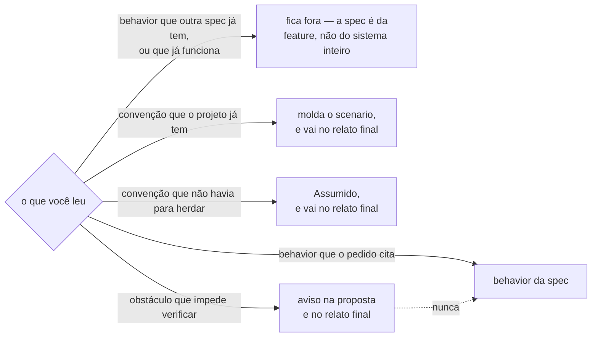
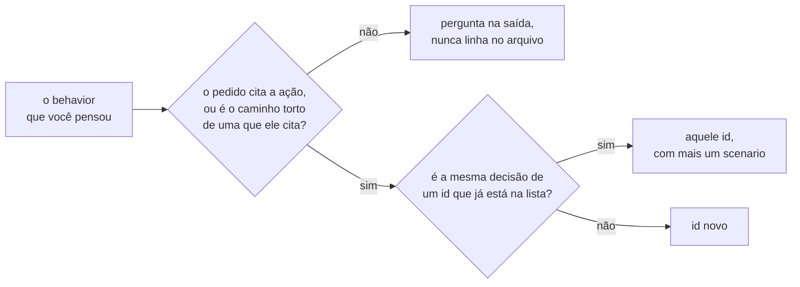
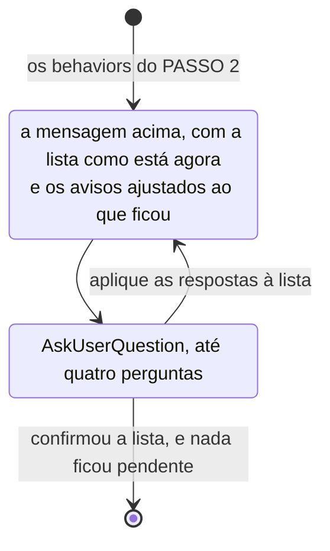

# spec — o que o sistema faz, em exemplos

Esqueleto do artefato: `TEMPLATE.md`, ao lado. Copie e preencha.

Você escreve **`spec.md` e nada mais**.

**As decisões que faltam não se resolvem aqui.** Ficam gravadas em `Assumido`, e quem para
em cada uma é o `/my-spec:clarify`, depois.

**`--assume` no pedido tira a parada do PASSO 3.** Em cada bifurcação você escolhe o valor
mais provável, grava em `Assumido` e leva para o relato final, que passa a ser a primeira
vez que o usuário vê a lista de `behaviors`.

## As três palavras

São as unidades do framework. Vêm em inglês, como as palavras-chave do Gherkin, para não se
confundirem com a prosa em volta.

**`spec`** — o arquivo `spec.md`, um por feature, com um ou vários `behaviors`. Ele é
permanente: teste e código citam id daqui, e a citação continua valendo depois que a feature
fecha. Por isso não fala de desenho — camada, biblioteca, quem gera o identificador, onde
mora a validação — nem de ordem de trabalho. Essas duas coisas mudam, e a `spec` não pode
mudar junto.

**`behavior`** — uma decisão do produto, numerada `B1`, `B2`. No arquivo é a seção que o id
abre: um bloco Gherkin com um ou vários `scenarios`, e embaixo dele as regras assumidas, no
campo `Assumido`, quando houve alguma. É a unidade que a `spec` numera, e a única coisa que
teste e código citam. Duas decisões são dois `behaviors`, ainda que se provoquem pela mesma
ação.

**`scenario`** — cada bloco que a palavra-chave `Scenario` abre dentro do `behavior`. É o
que uma pessoa lê para conferir e o que um teste verifica de ponta a ponta, com o valor
literal no `Then`. Não tem id próprio: quem cita um `scenario`, cita o `behavior` dele. Dois
`scenarios` no mesmo `behavior` são dois caminhos até a mesma decisão — outra ação, outra
entrada, outro estado inicial. Um `Scenario Outline` é um `scenario` com várias linhas de
`Examples`, e conta como um.

## PASSO 1 — LER

1. **O pedido** — o que veio no argumento da chamada. Vindo vazio, o pedido é o que o
   usuário já disse na conversa; não peça para ele repetir.
2. **Convenções do projeto** — `CLAUDE.md` ou arquivo de convenções. Não havendo, tire do
   repositório: idioma, formato das respostas de erro, o que o sistema já faz em situação
   parecida. Num projeto vazio não há o que herdar, então escolha — é a primeira feature que
   fixa a convenção para todas as próximas, e isso o usuário confirma agora, não descobre
   seis features depois.
3. **As outras `specs` e o repositório** — para saber o que já existe: `behavior` já
   especificado em outro lugar, ou que já funciona e ninguém vai mexer.
4. **O que impede a verificação** — dependência que bloqueia toda chamada, configuração sem
   a qual a aplicação não sobe, arquivo que não compila. Com um desses no caminho, nenhum
   `scenario` pode ser verificado e a lista inteira vira promessa.

   **Você só lê, nunca roda.** Relate apenas o que dá para descobrir lendo: teste falhando e
   build quebrado só aparecem para quem executa, e você não vai executar.

Onde cada coisa que você leu vai parar, e o caminho que não existe:



**Os desenhos deste skill são para o usuário conferir de uma olhada, e nenhum deles entra no
`spec.md`** — o `TEMPLATE.md` não tem diagrama nenhum. Para você eles são regra como o resto
do passo. Dentro do desenho os termos vão sem crase, porque ali não há markdown para
renderizar.

**O obstáculo nunca vira `behavior` da `spec`.** Se ninguém pediu autenticação, "autenticar
antes de criar" não é decisão do produto — é você contornando o obstáculo, e esse
contorno fica para sempre num arquivo que os testes citam.

## PASSO 2 — LEVANTAR OS BEHAVIORS

Serve como `behavior` o que alguém provoca e observa: sem ação e sem resultado à vista,
não há o que conferir.

**Um id por decisão, não por ação.** Recusar nome inválido ao criar e ao renomear é a mesma
decisão em dois lugares: um id, dois `scenarios`. A ação diferente é o que salta aos olhos,
e é por isso que você separa demais.

**Escreva o caminho torto junto com o certo** — entrada inválida, coisa que não existe,
estado impossível, a mesma chamada duas vezes. Ninguém pede isso, e é o que decide o
produto: o pedido diz "criar quadro", e sem isso sobra um sistema que aceita qualquer coisa.

**Pare onde o pedido para.** Vendo "criar convite", você completa o padrão: expiração,
limite de usos, revogação, notificação. Cada uma parece óbvia e nenhuma foi pedida. Escrito,
o `behavior` vira código sem ninguém ter decidido que o produto tem isso. A fronteira:
recusar entrada inválida é a mesma feature; expirar convite é outra.

As duas decisões, na ordem em que se tomam:



## PASSO 3 — PROPOR E PARAR

Uma linha por `behavior`, sem `scenario` nenhum:

````markdown
## criar convite — 5 behaviors

| id | behavior |
|----|----------|
| `B1` | criar um convite para um endereço de e-mail |
| `B2` | recusar e-mail malformado |
| `B3` | aceitar um convite pelo código |
| `B4` | recusar código que não existe |
| `B5` | listar os convites de quem enviou |

**Aviso** — uma dependência de autenticação já está no projeto e responde 401 a toda
requisição. Enquanto continuar assim, nenhum behavior acima pode ser verificado.

**Fora da lista** — expiração e revogação parecem vir junto, mas não estavam no pedido.
````

**A pergunta vai no seletor de opções, não no texto** — uma chamada de `AskUserQuestion`
logo depois da mensagem. A tabela e os avisos ficam onde estão, porque não cabem em rótulo
de opção; no seletor vai só o que o usuário decide. Para a lista acima: *a lista está
certa?* — confirmar, ajustar, dividir em `specs` — e *expiração e revogação?* — ficam de
fora, entram nesta `spec`. Uma pergunta por decisão, no mesmo seletor, até quatro.

Pergunta escrita em prosa é respondida em prosa, quando é respondida; e você tende a
seguir escrevendo o arquivo como se tivesse sido. Com o seletor não há como continuar
sem a resposta.

**O passo é um ciclo, não uma pergunta:**



**A seta que sai do ciclo é uma só**, e é a resposta que confirma a lista sem deixar
pendência. Havendo mais de quatro decisões, as outras vêm na volta seguinte. Você tende a
tratar a primeira chamada como a regra cumprida e seguir para o PASSO 4 — e aí a lista
corrigida nunca chega a ser vista por quem pediu a correção.

Volta nova só existe se a anterior deixou pendência ou se a resposta abriu uma. **Não
levante decisão para ter o que perguntar** — as decisões acabam, e a última pergunta é a
confirmação da lista.

**Lista longa se divide em `specs`, nunca pela metade.** Vinte `behaviors` quase sempre
querem dizer que ali tem mais de uma feature: um CRUD de pessoa é cadastro, consulta e
remoção, e cada um vira sua pasta com sua `spec` inteira. Diga onde a divisão cai e
pergunte; se o usuário responder que é uma feature só, escreva os vinte. O que não existe é
meia `spec` — o que ficasse de fora não estaria especificado em lugar nenhum, e escolher o
que é feito primeiro é trabalho do `tasks`, não daqui.

**Pare aqui, e só aqui.** Acertar a lista custa uma linha por item; errá-la custa quinze
`scenarios` jogados fora. Com `--assume`, nem a mensagem deste passo existe: siga para o
PASSO 4 e deixe a lista aparecer no relato final.

## PASSO 4 — PREENCHER O TEMPLATE

`specs/<feature>/spec.md`, a partir do `TEMPLATE.md`. O que sobrar do esqueleto sai:
colchete não preenchido, seção vazia, e o rótulo em itálico que diz quando o campo entra —
ele é instrução para você, não texto do artefato. O esqueleto mostra dois `behaviors` e
duas formas de `scenario`; a feature tem quantos tiver.

### O scenario

**Palavra-chave em inglês, texto do passo no idioma do projeto.** `Scenario`, `Given`,
`When`, `Then`, `And`, `Scenario Outline`, `Examples` são a estrutura, iguais em todo
projeto, e a palavra-chave é o próprio nome da unidade. O que a pessoa lê para conferir é o
texto do passo, e esse é o idioma dela: trocá-lo por realce de sintaxe é mau negócio.

**O `scenario` é texto, não código.** Ele não é o código que executa cada linha, e o
framework não pressupõe nada que execute Gherkin — quem instala isso pode nunca ter usado
Cucumber. Do outro lado existe um teste escrito na tecnologia do projeto, que verifica este
`scenario`. O `scenario` é o que uma pessoa lê; o teste é o que a máquina roda.

**Todo `scenario` é verificado de ponta a ponta, contra o sistema de verdade.** Banco real,
requisição real, cena carregada, sem peça trocada por uma de mentira. Escreva sabendo
disso: se o `scenario` só passa com metade do sistema substituída, ele não verifica o que
promete. `Then recebo o e-mail de convite` obriga um servidor de e-mail no teste — o que
não proíbe o `scenario`, mas às vezes mostra que o certo é olhar outra coisa: a mensagem na
fila, a linha na tabela.

**O `Then` carrega o valor literal.** `recebo 201 com Location: /convites/{codigo}`, não
"recebo a resposta certa" — descrever o resultado em vez de escrevê-lo faz a verificação
aceitar qualquer coisa.

**Onde entram tempo, frame ou física, o resultado é faixa:** `a porta termina de abrir em
menos de um segundo`, nunca `abre em exatamente 0,5s`. Número exato ali falha em outra
máquina, e quem confere aprende a ignorar o resultado.

**O `Given` é o estado inicial, e só aparece quando não é o padrão do projeto.** Num backend
ele quase sempre some, porque o padrão é banco vazio; num jogo, `o inimigo a 10 metros do
jogador` é o que decide se o que a pessoa viu era o esperado.

Um `behavior` com várias entradas vira `Scenario Outline` com tabela de `Examples`.

### Assumido

**Decisão que falta não é inventada em silêncio.** Se o `scenario` precisa de um valor que
ninguém definiu — o limite de um campo, a ordem de uma listagem, a resposta ao apagar o que
não existe —, use o valor mais provável, registre em `Assumido` embaixo do `behavior`
que o usou, e leve a mesma linha para a saída. Sem isso, uma decisão de produto entra no
sistema sem ninguém ter decidido nada.

**Convenção que você escolheu por não haver o que herdar entra aqui**, no primeiro
`behavior` que a usou — repetida em cada um vira ruído. Convenção herdada do
repositório não entra: ela tem dono fora da `spec` e muda sem que a feature mude, e a `spec`
não pode mudar junto.

O registro entra mesmo quando o `scenario` já mostra o valor: o `scenario` diz o que
acontece, o campo diz que ninguém escolheu. Lista comprida é sinal, não sujeira — não junte
nem resuma para o campo ficar curto. E não registre o que a feature deixou de fora: "o
convite não tem limite de usos" é `behavior` de uma feature que não existe, e escrever isso
aqui é a primeira aparição dela no sistema.

### Ids

`B1`, `B2`… na ordem em que aparecem no arquivo. **O número não é reaproveitado:**
`behavior` removido deixa o id vago, porque algum teste pode citar aquele número — e o
novo entra com o próximo id livre, mesmo que o lugar dele seja no meio do arquivo.

## PASSO 5 — RELATAR

O arquivo, e depois o que ele não mostra:

````markdown
`specs/criar-convite/spec.md` — 5 behaviors, 9 scenarios.

**Aviso** — a dependência de autenticação responde 401 a toda requisição, e até isso mudar
nenhum scenario daqui pode ser verificado.

**Faltam decisões de produto** — o valor assumido já está gravado, e trocá-lo é editar uma
linha do `Then`:

- ordem da listagem (assumi mais novo primeiro)
- aceitar o mesmo convite duas vezes (assumi 409)

**Segui a convenção do repositório** — a criação responde 201 com `Location`, e o corpo
repete o que foi criado.

**Ficou de fora** — expiração e revogação, que não estavam no pedido.

**Custa caro verificar** — o scenario do `B1` termina em e-mail entregue, e isso pede um
servidor de e-mail no teste. Ele poderia terminar na mensagem na fila.

Rode `/my-spec:clarify` para resolver os 2 assumidos.
````

**A última linha entra sempre**, com ou sem assumido pendente: o `clarify` também é onde a
`spec` é aprovada.

Com `--assume`, diga na primeira linha que rodou assim — nem a lista de `behaviors` foi
confirmada.

**Só o detectado.** Rótulo em negrito parece seção obrigatória, e seção que aparece sempre
— às vezes só para dizer que não há nada — ensina o usuário a pular a parte de baixo
inteira. Reporte a contagem sem julgar por ela.